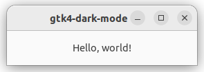
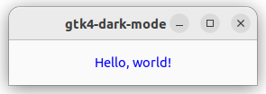
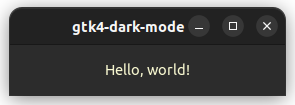
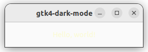

How To Style Your GTK4 Rust App With CSS
========================================

**With Dynamic Support for Light and Dark Mode**

_(Originally published at https://jamesbenner.hashnode.dev/how-to-style-your-gtk4-rust-app-with-css)_

GTK apps look pretty nice by default but sometimes you may want to customize the looks of them. In this article, we'll go over how to do so using CSS. Basic knowledge of CSS is assumed for this article but if you're not familiar with it MDN has great resources [here](https://developer.mozilla.org/en-US/docs/Web/CSS).

## Adding CSS Styling

First, we'll start with a minimal app located in `src/main.rs`:

```rust
use gtk::prelude::*;

fn on_activate(application: &gtk::Application) {
    let window = gtk::ApplicationWindow::new(application);
    let label = gtk::Label::new(Some("Hello, world!"));
    let width = 275;
    let height = 50;

    window.set_child(Some(&label));
    window.set_default_size(width, height);
    window.present();
}

fn main() {
    let app = gtk::Application::builder()
        .application_id("com.example.gtk4-dark-mode")
        .build();

    app.connect_activate(on_activate);
    app.run();
}
```

With a corresponding `Cargo.toml`:

```ini
[package]
name = "gtk4-dark-mode"
version = "0.1.0"
edition = "2021"

[dependencies]
gtk = { version = "0.6.1", package = "gtk4", features = ["v4_6"] }
```

As an aside, you'll notice that I have `features` set to "v4\_6". That's because I'm on Ubuntu 22.04 LTS and it's the available version. You can check your version of GTK4 by running this command:

```bash
pkg-config --modversion gtk4
```

Try running `cargo run` and it will show us this:

<div align="center">
    
</div>

Great, we've got our basic app running. Now let's add some CSS. But before we do that we need to make a style sheet to load.

Here's our new style sheet located at `styles/light.css`:

```css
label {
    color: blue;
}
```

We're simply looking for any `label` node (which corresponds to any [`gtk::Label`](https://gtk-rs.org/gtk4-rs/stable/latest/docs/gtk4/struct.Label.html)) and coloring it blue. Of note, if you ever need to determine the node name for a specific widget you can look it up by the widget name under the "CSS nodes" section of the relevant widget page on the gtk-rs website [here](https://gtk-rs.org/gtk4-rs/stable/latest/docs/gtk4/index.html). For example [here](https://gtk-rs.org/gtk4-rs/stable/latest/docs/gtk4/struct.Button.html#css-nodes) is the "CSS nodes" section for `gtk::Button`. You'll notice that `gtk::Button` also has some predefined classes you can use as well such as `suggested-action` and `destructive-action`.

Now to actually load our style sheet. We'll go back to `src/main.rs` and add a `load_css()` function.

```rust
use gtk::prelude::*;
use gtk::gdk;

fn load_css() {
    let display = gdk::Display::default().expect("Could not get default display.");
    let provider = gtk::CssProvider::new();
    let priority = gtk::STYLE_PROVIDER_PRIORITY_APPLICATION;

    provider.load_from_data(include_str!("../styles/light.css"));
    gtk::StyleContext::add_provider_for_display(&display, &provider, priority);
}

fn on_activate(application: &gtk::Application) {
    let window = gtk::ApplicationWindow::new(application);
    let label = gtk::Label::new(Some("Hello, world!"));
    let width = 275;
    let height = 50;

    load_css();
    window.set_child(Some(&label));
    window.set_default_size(width, height);
    window.present();
}
```

I've omitted the `main()` function from this snippet since nothing changed there. Now that we've made these changes let's run `cargo run` again and see how it looks now.

<div align="center">
    
</div>

We've got a splash of color now! So let's look at the `load_css()` function we just added and walk through it.

First, we get the default display via [`gdk::Display::default()`](https://gtk-rs.org/gtk4-rs/stable/latest/docs/gdk4/struct.Display.html#method.default) since we'll need that to attach our CSS provider to it. Second, we instantiate our CSS provider via [`gtk::CssProvider::new()`](https://gtk-rs.org/gtk4-rs/stable/latest/docs/gtk4/struct.CssProvider.html#method.new), like its name suggests we'll load our CSS into it and it will provide it to our display. And for our third and final variable declaration, we're defining the priority of our style context. We're using [`gtk::STYLE_PROVIDER_PRIORITY_APPLICATION`](https://gtk-rs.org/gtk4-rs/stable/latest/docs/gtk4/constant.STYLE_PROVIDER_PRIORITY_APPLICATION.html) but there are other priorities available as well that you can find [here](https://gtk-rs.org/gtk4-rs/stable/latest/docs/gdk4/index.html?search=gtk4%3A%3ASTYLE_PROVIDER_PRIORITY) for reference. Now we load our CSS into our provider using [`gtk::StyleContext::add_provider_for_display()`](https://gtk-rs.org/gtk4-rs/stable/latest/docs/gtk4/struct.StyleContext.html#method.add_provider_for_display), here we're utilizing Rust's [`include_str!()`](https://doc.rust-lang.org/std/macro.include_str.html) macro which will load the file contents into a `&'static str` at compile time. Please note that the path provided to `include_str!()` isn't normalized at all so if you are on Windows you'd need to use the appropriate path syntax. Lastly, we use [`gtk::StyleContext::add_provider_for_display()`](https://gtk-rs.org/gtk4-rs/stable/latest/docs/gtk4/struct.StyleContext.html#method.add_provider_for_display) to attach our CSS provider to our display and set its priority.

## Adding Classes and IDs

We've got our basic styling in place but what if we need to get more specific with our selectors than using nodes like `label`? Then we'll need to be able to add classes and IDs to our widgets. Let's start by adding a class to our label in `src/main.rs`. We're only showing the `on_activate()` function since that's the only code that has been changed.

```rust
fn on_activate(application: &gtk::Application) {
    let window = gtk::ApplicationWindow::new(application);
    let label = gtk::Label::new(Some("Hello, world!"));
    let width = 275;
    let height = 50;

    label.add_css_class("class-name");
    load_css();
    window.set_child(Some(&label));
    window.set_default_size(width, height);
    window.present();
}
```

As you can see we merely have to call [`label.add_css_class()`](https://gtk-rs.org/gtk4-rs/stable/latest/docs/gtk4/prelude/trait.WidgetExt.html#tymethod.add_css_class) with our desired class name. But what if we want to add multiple class names? Let's update our `src/main.rs` file again:

```rust
fn on_activate(application: &gtk::Application) {
    let window = gtk::ApplicationWindow::new(application);
    let label = gtk::Label::new(Some("Hello, world!"));
    let width = 275;
    let height = 50;

    label.set_css_classes(&["one", "two"]);
    load_css();
    window.set_child(Some(&label));
    window.set_default_size(width, height);
    window.present();
}
```

Great, now we've set multiple class names via [`label.set_css_classes()`](https://gtk-rs.org/gtk4-rs/stable/latest/docs/gtk4/prelude/trait.WidgetExt.html#tymethod.set_css_classes). What if we want even more specificity though? Then we'll want to set an ID. Once again we'll update our `src/main.rs` file:

```rust
fn on_activate(application: &gtk::Application) {
    let window = gtk::ApplicationWindow::new(application);
    let label = gtk::Label::new(Some("Hello, world!"));
    let width = 275;
    let height = 50;

    label.set_widget_name("identifier");
    load_css();
    window.set_child(Some(&label));
    window.set_default_size(width, height);
    window.present();
}
```

This one isn't as semantic since we call the method [`label.set_widget_name()`](https://gtk-rs.org/gtk4-rs/stable/latest/docs/gtk4/prelude/trait.WidgetExt.html#tymethod.set_widget_name) to set the ID instead of something like `label.set_widget_id()`. But regardless we've successfully added an ID to our widget.

## Adding Dark Mode Support

Now that we've added CSS styling to our app we can start implementing dark mode. Note, that we're going to discard the class and ID changes we made in the prior section. First, we'll make our new dark style sheet at `styles/dark.css:`

```css
label {
    color: lightgoldenrodyellow;
}
```

We'll add some more code to `src/main.rs` as well, once again we're omitting the `main()` function here since no changes are being made to it.

```rust
use gtk::gdk;
use gtk::prelude::*;

fn load_css(settings: &gtk::Settings) {
    let display = gdk::Display::default().expect("Could not get default display.");
    let provider = gtk::CssProvider::new();
    let priority = gtk::STYLE_PROVIDER_PRIORITY_APPLICATION;
    let theme_name = settings.gtk_theme_name().expect("Could not get theme name.");

    if theme_name.to_lowercase().contains("dark") || settings.is_gtk_application_prefer_dark_theme() {
        provider.load_from_data(include_str!("../styles/dark.css"));
    } else {
        provider.load_from_data(include_str!("../styles/light.css"));
    }

    gtk::StyleContext::add_provider_for_display(&display, &provider, priority);
}

fn on_activate(application: &gtk::Application) {
    if let Some(settings) = gtk::Settings::default() {
        load_css(&settings);
    }

    let window = gtk::ApplicationWindow::new(application);
    let label = gtk::Label::new(Some("Hello, world!"));
    let width = 275;
    let height = 50;

    window.set_child(Some(&label));
    window.set_default_size(width, height);
    window.present();
}
```

Let's change our system to prefer a dark theme and run `cargo run` again to see our changes.

<div align="center">
    
</div>

As you can see GTK automatically adjusts the color of our background and title bar without us doing anything so we get some changes for free with our customization.

So what did we do to get here? Well first off we changed the function signature of `load_css()`, you'll notice it now takes a reference to a [`gtk::Settings`](https://gtk-rs.org/gtk4-rs/stable/latest/docs/gtk4/struct.Settings.html) instance as a parameter. That's because we're going to use it to look up a couple of things. For instance, you'll notice we've added a `theme_name` variable that we've pulled from settings. We've also moved loading CSS into our provider into an `if` statement. We're checking to see if the lowercase theme name contains the word "dark" or if the [`gtk-application-prefer-dark-theme`](https://docs.gtk.org/gtk4/property.Settings.gtk-application-prefer-dark-theme.html) setting is `true`, then we load our dark style sheet otherwise we load our light style sheet.

## Dynamic Light/Dark Mode Support

So we've got light and dark mode styles supported but we've got a small problem with our current implementation. If you change your desktop theme to dark or light while our app is open the styles don't change in real-time. This can be a real problem. For example, let's look at what our app would look like if we changed from dark to light mode while the app was open.

<div align="center">
    
</div>

You can barely even tell there's a label there, let alone read it. We can fix this though!

Here's `src/main.rs` again but this time we've only changed `on_activate()` so that's all that we'll show:

```rust
fn on_activate(application: &gtk::Application) {
    if let Some(settings) = gtk::Settings::default() {
        settings.connect_gtk_application_prefer_dark_theme_notify(load_css);
        settings.connect_gtk_theme_name_notify(load_css);
        load_css(&settings);
    }

    let window = gtk::ApplicationWindow::new(application);
    let label = gtk::Label::new(Some("Hello, world!"));
    let width = 275;
    let height = 50;

    window.set_child(Some(&label));
    window.set_default_size(width, height);
    window.present();
}
```

All we needed to change was that we call the [`connect_gtk_application_prefer_dark_theme_notify()`](https://gtk-rs.org/gtk4-rs/stable/latest/docs/gtk4/struct.Settings.html#method.connect_gtk_application_prefer_dark_theme_notify) and [`connect_gtk_theme_name_notify()`](https://gtk-rs.org/gtk4-rs/stable/latest/docs/gtk4/struct.Settings.html#method.connect_gtk_theme_name_notify) methods on our `settings` object while passing the `load_css` function to them as a callback argument. These, as their names imply, will fire off when the dark theme preference or theme name changes and reloads our CSS.

## Conclusion

And that's it for styling your GTK4 Rust app with CSS. You can find the code for this article [here](https://github.com/jbenner-radham/rust-gtk4-css-styling) for reference. Hopefully, this article was helpful to you. If you've got any feedback or questions feel free to leave a comment.
